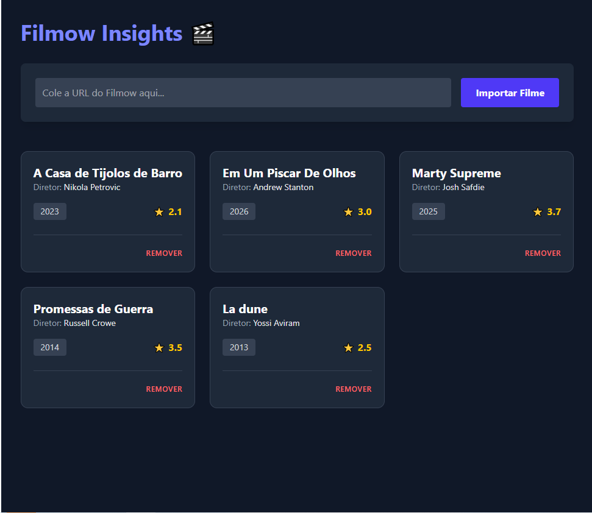

# 🎬 Filmow Insights

O **Filmow Insights** é uma ferramenta de automação e análise de dados cinematográficos. Ele permite que o usuário importe dados detalhados de filmes diretamente da rede social Filmow apenas colando a URL. A aplicação realiza o web scraping, processa as informações e as organiza em um dashboard moderno.



## 🚀 Motivação e Objetivos
Este projeto foi desenvolvido como parte do meu portfólio de Desenvolvedor Ruby on Rails, com foco em resolver problemas reais de extração de dados e organização de interface.

* **Engenharia de Dados:** Captura de dados não estruturados (HTML) e conversão em dados relacionais.
* **Clean Code:** Uso de *Service Objects* para isolar a lógica de scraping, mantendo os Controllers limpos.
* **User Experience:** Interface responsiva e minimalista utilizando Tailwind CSS em Dark Mode.

## 🛠️ Tecnologias
* **Framework:** Ruby on Rails 7
* **Linguagem:** Ruby 3.1.2
* **Banco de Dados:** PostgreSQL
* **Web Scraping:** Nokogiri & Open-URI
* **Estilização:** Tailwind CSS

## 📋 Funcionalidades
- [x] **Importação Inteligente:** Scraper que extrai Título, Diretor, Ano e Nota.
- [x] **Tratamento de Dados:** Limpeza de strings e normalização de anos/notas.
- [x] **Prevenção de Duplicidade:** O sistema identifica se um filme já foi importado pela URL, evitando redundância no banco.
- [x] **Dashboard Dark Mode:** Visualização em cards com feedback visual de notas e datas.
- [ ] **Correção de Encoding:** Ajuste para caracteres especiais em títulos brasileiros (Próxima Sprint).
- [ ] **Feedback de Carregamento:** Adição de Spinner para o processo de importação (Próxima Sprint).

## 🧠 Desafios Técnicos Superados

### 1. Seletores CSS Voláteis
Sites como o Filmow alteram suas classes frequentemente. Durante o desenvolvimento, mapeei a transição de seletores como `.average` para `.rating-badge__value`, garantindo a resiliência do scraper através de seletores mais específicos e tratamento de exceções.

### 2. Arquitetura de Serviços
Para garantir a manutenibilidade, implementei o `FilmowScraperService`. Isso permite que a lógica de extração seja testada isoladamente no console do Rails ou reutilizada em outras partes do sistema sem duplicar código.

## 🔧 Como Executar

1. **Clone o projeto:**
   ```bash
   git clone [https://github.com/Peuvictor/filmow-insights.git](https://github.com/Peuvictor/filmow-insights.git)
   cd filmow-insights
   bundle install
   rails db:create
   rails db:migrate
   rails s


## Desenvolvido por Pedro Victor Guimarães
